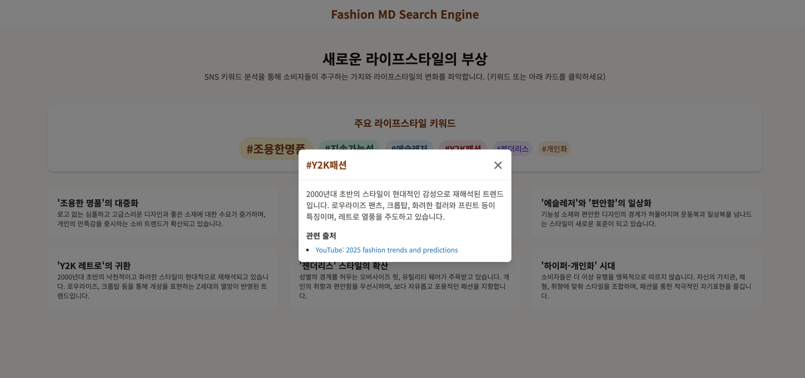
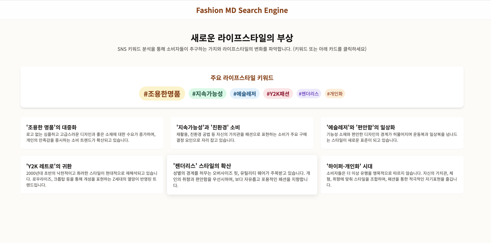

# 1. Use case
- 주제: 패션 MD 전용 서치 엔진
- 타겟: 신상품 기획을 위해 기획안을 작성해야하는데, 인터넷에 퍼져있는 최신 패션 관련 인사이트를 통합적으로 한 번에 확인하여 검색 시간을 줄이고 싶은 유니클로의 MD
- 문제 상황: 패션 기업의 MD들이 브랜드의 매출을 올릴 목적으로 신상품을 기획할 때, 여러 정보들을 검색하고 찾아보며 기획안을 작성해야 합니다. 이때 인터넷에 불확실하고, 너무 많은 정보가 퍼져있어서 검색 시간이 오래 걸리고, 트렌드를 한 눈에 파악하기 어렵다는 문제가 존재합니다.
구체적으로 어떤 기획을 해야 할지 탐색할 때 마다, MD들이 조사해야하는 내용이 아래와 같이 많습니다. 
  - 우리 브랜드에서 긍정/부정적인 리뷰는 어떤 것들이 있었는지
  - 경쟁사들은 어떤 옷들을 최근에 출시했는지 확인해야하며
  - 현재 패션 트렌드가 어떻게 변화하고 있는지 4대 런웨이의 보고서를 참고해야하고
  - SNS에서는 어떤 라이프 스타일이 유행하는지 확인해야 합니다.
이러한 트렌드에 대한 시장조사를 MD들이 새로운 옷을 기획할 때마다 반복적으로 해야하는데, 이런 시장조사에 드는 시간이 만만치 않습니다.

# 2. 해결방안
[프로토타입](https://unk0vvvn.github.io/teaMatch/)

- SNS 키워드 분석을 통해 소비자들이 추구하는 가치와 라이프스타일의 변화를 한 눈에 파악할 수 있습니다. 매번 기획안을 작성할 때마다 반복적으로 여러 키워드를 검색하고, 웹사이트를 서핑하지 않아도, 이 검색엔진에서 출처를 바로 제공하므로 최신 트렌트인 패션 키워드 관련 정보를 빠르게 파악할 수 있습니다.
- 예상 가격 : 월 60만원 / LF패션 남성복 기획MD 신입의 초봉인 3350만원의 20%

- 이를 통해 일일이 키워드를 검색하지 않아도 트렌드를 바로 파악하고 인사이트를 얻을 수 있습니다.
